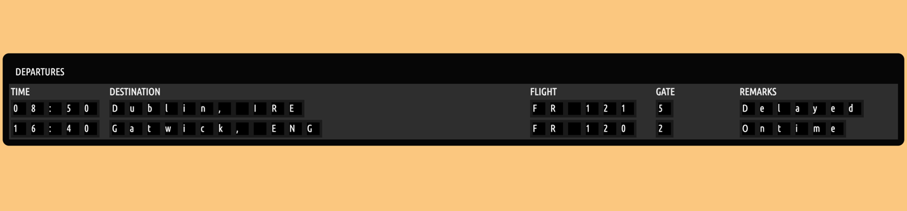

# Flights app

Project to practise frontend animations and setState + useEffect. 
Setup using Create React App. 

### In the project directory, you can run:

npm start
Runs the app in the development mode.

Open http://localhost:3000 to view it in your browser. The page will reload when you make changes.
You may also see any lint errors in the console.

Departure tiles are animated and on load spin. Created following Ania Kubów tutorial.

